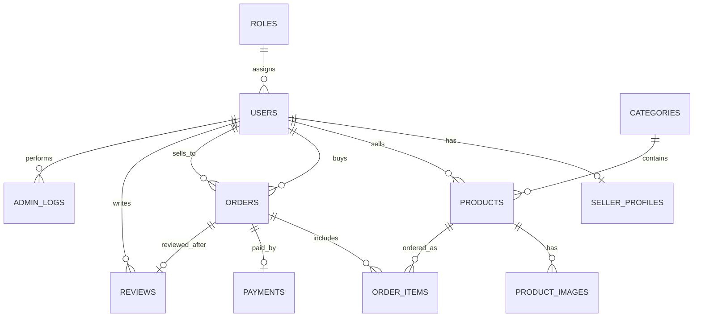
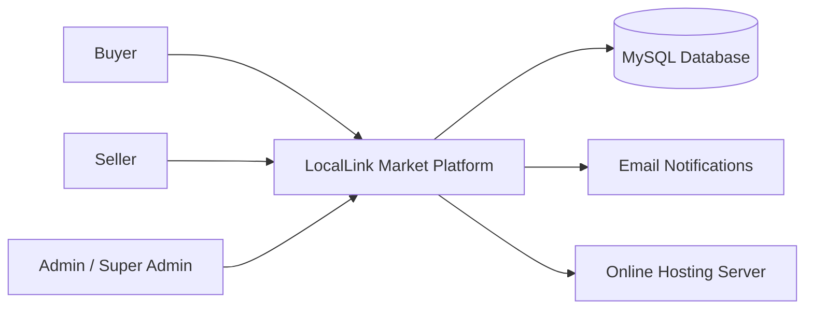
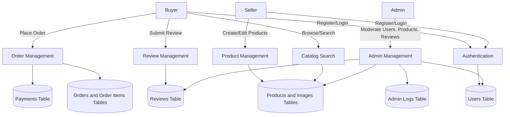
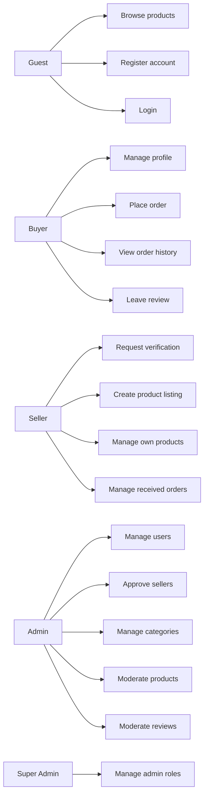

# C2C E-Commerce Platform Build Plan

Project name placeholder: **LocalLink Market**

This document translates the ITECA project brief into a simple build plan for a hosted Consumer-to-Consumer e-commerce platform using **HTML, CSS, JavaScript, PHP, and MySQL**. The product focus is a South African C2C marketplace that helps informal traders and individual sellers list products, receive orders, and build buyer trust through verified profiles, reviews, and admin moderation.

## 1. Assignment Requirements

Source documents:

- `ITECA - Deliverable 1.pdf`
- `ITECA3-12 Initial Project_ Deliverable 2 _ Eduvos.pdf`

Required platform type:

- Customer-to-Customer / Consumer-to-Consumer e-commerce platform only.
- Buyers and sellers must be individual users.
- The platform must allow customers to buy and sell goods.
- The platform must include an admin website.
- The admin website must support Role-Based Access Control (RBAC).
- The admin website must create, display, update, and delete different user types.
- The website must be hosted online. Localhost submission is not allowed.

Required technologies:

- HTML
- CSS
- JavaScript, with jQuery allowed
- PHP
- MySQL
- Bootstrap is allowed
- CMS tools such as WordPress, Wix, and similar builders are not allowed

Required Deliverable 2 evidence:

- Introduction under 200 words
- Responsive prototype screenshots for smartphone, tablet, and desktop
- Main website prototype
- Admin website prototype
- CRC cards
- Enhanced Entity Relationship Diagram
- Context diagram
- Data Flow Diagram
- Use Case diagram
- Database schema
- Final website screenshots
- Sample PHP code
- Sample HTML code
- Sample JavaScript code
- Sample CSS code
- MySQL table screenshots
- Conclusion

## 2. Product Summary

LocalLink Market is a C2C marketplace for South African informal traders, township entrepreneurs, and local consumers. Sellers can create verified profiles, list products with images, manage stock, and receive customer orders. Buyers can browse local products, view seller reputation, place orders, and leave reviews after completed purchases. Administrators manage users, seller verification, products, categories, orders, reviews, and platform roles through a secure RBAC admin dashboard. The platform will be responsive, lightweight, and optimized for low-data environments by using simple layouts, compressed images, Bootstrap components, and minimal JavaScript.

## 3. MVP Scope

The first version should be intentionally simple. Build the features that prove the C2C marketplace works before adding advanced integrations.

### Main Website

Core pages:

- Home page with featured categories and recent products
- Product listing page with search, category filter, and price filter
- Product details page with seller information and order action
- Register page
- Login page
- Buyer dashboard
- Seller dashboard
- Add product page
- Edit product page
- Cart or order checkout page
- Order history page
- Review seller/product page
- User profile page

Core buyer features:

- Register and log in
- Browse products
- Search and filter products
- View product details
- Place an order
- View order status
- Leave reviews after completed orders

Core seller features:

- Register and log in
- Request seller verification
- Create product listings
- Upload product images
- Edit and deactivate own products
- View received orders
- Update order status

### Admin Website

Core admin pages:

- Admin login
- Admin dashboard
- User management
- Role management
- Seller verification queue
- Category management
- Product moderation
- Order management
- Review moderation

Core admin features:

- Create, read, update, and delete users
- Assign roles
- Approve or reject seller verification requests
- Suspend users
- Manage categories
- Hide inappropriate product listings
- View order activity
- Remove abusive reviews

## 4. User Roles and RBAC

| Role | Access Level | Main Permissions |
| --- | --- | --- |
| Guest | Public | Browse home page, view product listings, register, log in |
| Buyer | Authenticated user | Place orders, manage profile, view order history, write reviews |
| Seller | Authenticated seller | Buyer permissions plus create/edit own products and manage received orders |
| Admin | Platform staff | Manage users, roles, categories, products, orders, reviews, and seller verification |
| Super Admin | System owner | Full access including creating admin users and changing roles |

RBAC rules:

- Every protected PHP page must check the logged-in user's role.
- Buyers must not access seller-only pages unless approved as sellers.
- Sellers must only edit their own products.
- Admin users must not access the public checkout as an admin action.
- Super Admin should be the only role allowed to create or delete admin accounts.

## 5. Technical Architecture

Use a simple PHP/MySQL architecture that is easy to explain during presentation.

```text
Browser
  |
  | HTML, CSS, JavaScript, Bootstrap
  v
PHP Pages and Controllers
  |
  | PDO prepared statements
  v
MySQL Database
```

Recommended backend approach:

- Plain PHP with reusable includes.
- PDO for database access.
- PHP sessions for authentication.
- Password hashing with `password_hash()` and `password_verify()`.
- Server-side validation for every form.
- Prepared statements for every SQL query.

Recommended frontend approach:

- Bootstrap for responsive layout.
- Custom CSS for branding and spacing.
- Small JavaScript files for form validation, image preview, filters, and dashboard interactions.
- Avoid heavy animation and large images to support low-data users.

## 6. Suggested Folder Structure

```text
local-link-market/
  admin/
    dashboard.php
    users.php
    roles.php
    verification.php
    categories.php
    products.php
    orders.php
    reviews.php
  assets/
    css/
      styles.css
      admin.css
    js/
      app.js
      admin.js
    images/
      logo.png
      placeholders/
  config/
    database.php
    app.php
  includes/
    auth.php
    header.php
    footer.php
    navbar.php
    admin_header.php
    admin_sidebar.php
    functions.php
  uploads/
    products/
  database/
    schema.sql
    seed.sql
  index.php
  products.php
  product.php
  cart.php
  checkout.php
  orders.php
  profile.php
  seller-dashboard.php
  add-product.php
  edit-product.php
  login.php
  register.php
  logout.php
```

## 7. Database Design

Core tables:

- `roles`
- `users`
- `seller_profiles`
- `categories`
- `products`
- `product_images`
- `orders`
- `order_items`
- `payments`
- `reviews`
- `admin_logs`

### Database Schema Draft

```sql
CREATE TABLE roles (
  id INT AUTO_INCREMENT PRIMARY KEY,
  name VARCHAR(50) NOT NULL UNIQUE,
  description VARCHAR(255),
  created_at TIMESTAMP DEFAULT CURRENT_TIMESTAMP
);

CREATE TABLE users (
  id INT AUTO_INCREMENT PRIMARY KEY,
  role_id INT NOT NULL,
  full_name VARCHAR(120) NOT NULL,
  email VARCHAR(150) NOT NULL UNIQUE,
  phone VARCHAR(30),
  password_hash VARCHAR(255) NOT NULL,
  status ENUM('active', 'suspended', 'pending') DEFAULT 'active',
  created_at TIMESTAMP DEFAULT CURRENT_TIMESTAMP,
  updated_at TIMESTAMP DEFAULT CURRENT_TIMESTAMP ON UPDATE CURRENT_TIMESTAMP,
  FOREIGN KEY (role_id) REFERENCES roles(id)
);

CREATE TABLE seller_profiles (
  id INT AUTO_INCREMENT PRIMARY KEY,
  user_id INT NOT NULL UNIQUE,
  business_name VARCHAR(150),
  location VARCHAR(150),
  verification_status ENUM('not_requested', 'pending', 'approved', 'rejected') DEFAULT 'not_requested',
  verification_notes TEXT,
  created_at TIMESTAMP DEFAULT CURRENT_TIMESTAMP,
  FOREIGN KEY (user_id) REFERENCES users(id)
);

CREATE TABLE categories (
  id INT AUTO_INCREMENT PRIMARY KEY,
  name VARCHAR(100) NOT NULL UNIQUE,
  description VARCHAR(255),
  status ENUM('active', 'inactive') DEFAULT 'active'
);

CREATE TABLE products (
  id INT AUTO_INCREMENT PRIMARY KEY,
  seller_id INT NOT NULL,
  category_id INT NOT NULL,
  title VARCHAR(150) NOT NULL,
  description TEXT NOT NULL,
  price DECIMAL(10,2) NOT NULL,
  quantity INT NOT NULL DEFAULT 1,
  location VARCHAR(150),
  status ENUM('active', 'inactive', 'hidden', 'sold') DEFAULT 'active',
  created_at TIMESTAMP DEFAULT CURRENT_TIMESTAMP,
  updated_at TIMESTAMP DEFAULT CURRENT_TIMESTAMP ON UPDATE CURRENT_TIMESTAMP,
  FOREIGN KEY (seller_id) REFERENCES users(id),
  FOREIGN KEY (category_id) REFERENCES categories(id)
);

CREATE TABLE product_images (
  id INT AUTO_INCREMENT PRIMARY KEY,
  product_id INT NOT NULL,
  image_path VARCHAR(255) NOT NULL,
  is_primary BOOLEAN DEFAULT FALSE,
  created_at TIMESTAMP DEFAULT CURRENT_TIMESTAMP,
  FOREIGN KEY (product_id) REFERENCES products(id)
);

CREATE TABLE orders (
  id INT AUTO_INCREMENT PRIMARY KEY,
  buyer_id INT NOT NULL,
  seller_id INT NOT NULL,
  order_status ENUM('pending', 'accepted', 'paid', 'ready', 'completed', 'cancelled') DEFAULT 'pending',
  total_amount DECIMAL(10,2) NOT NULL,
  delivery_method ENUM('collection', 'local_delivery') DEFAULT 'collection',
  created_at TIMESTAMP DEFAULT CURRENT_TIMESTAMP,
  updated_at TIMESTAMP DEFAULT CURRENT_TIMESTAMP ON UPDATE CURRENT_TIMESTAMP,
  FOREIGN KEY (buyer_id) REFERENCES users(id),
  FOREIGN KEY (seller_id) REFERENCES users(id)
);

CREATE TABLE order_items (
  id INT AUTO_INCREMENT PRIMARY KEY,
  order_id INT NOT NULL,
  product_id INT NOT NULL,
  quantity INT NOT NULL,
  unit_price DECIMAL(10,2) NOT NULL,
  FOREIGN KEY (order_id) REFERENCES orders(id),
  FOREIGN KEY (product_id) REFERENCES products(id)
);

CREATE TABLE payments (
  id INT AUTO_INCREMENT PRIMARY KEY,
  order_id INT NOT NULL,
  payment_method ENUM('eft', 'cash_on_collection', 'mock_card') DEFAULT 'eft',
  payment_status ENUM('pending', 'submitted', 'confirmed', 'failed', 'refunded') DEFAULT 'pending',
  reference_number VARCHAR(100),
  proof_of_payment_path VARCHAR(255),
  created_at TIMESTAMP DEFAULT CURRENT_TIMESTAMP,
  FOREIGN KEY (order_id) REFERENCES orders(id)
);

CREATE TABLE reviews (
  id INT AUTO_INCREMENT PRIMARY KEY,
  order_id INT NOT NULL,
  reviewer_id INT NOT NULL,
  seller_id INT NOT NULL,
  rating INT NOT NULL CHECK (rating BETWEEN 1 AND 5),
  comment TEXT,
  status ENUM('visible', 'hidden') DEFAULT 'visible',
  created_at TIMESTAMP DEFAULT CURRENT_TIMESTAMP,
  FOREIGN KEY (order_id) REFERENCES orders(id),
  FOREIGN KEY (reviewer_id) REFERENCES users(id),
  FOREIGN KEY (seller_id) REFERENCES users(id)
);

CREATE TABLE admin_logs (
  id INT AUTO_INCREMENT PRIMARY KEY,
  admin_id INT NOT NULL,
  action VARCHAR(150) NOT NULL,
  entity_type VARCHAR(80),
  entity_id INT,
  created_at TIMESTAMP DEFAULT CURRENT_TIMESTAMP,
  FOREIGN KEY (admin_id) REFERENCES users(id)
);
```

## 8. Draft EERD

This Mermaid diagram can be recreated visually in Figma, FigJam, draw.io, or any diagramming tool required for submission.



## 9. Context Diagram



## 10. Data Flow Diagram



## 11. Use Case Diagram Draft



## 12. CRC Cards

| Class | Responsibilities | Collaborators |
| --- | --- | --- |
| User | Store account details, authenticate user, connect user to role | Role, Order, Review |
| Role | Define permissions for Buyer, Seller, Admin, and Super Admin | User |
| SellerProfile | Store business name, location, and verification status | User, Admin |
| Product | Store item details, price, stock, status, and seller owner | User, Category, ProductImage, OrderItem |
| Category | Group products into searchable sections | Product |
| ProductImage | Store image paths for product listings | Product |
| Order | Track buyer, seller, status, total, and delivery method | User, OrderItem, Payment, Review |
| OrderItem | Store product quantity and unit price within an order | Order, Product |
| Payment | Track selected method, proof, and payment status | Order |
| Review | Store rating and comment after completed order | User, Order |
| AdminLog | Record admin actions for accountability | User |

## 13. Figma Design Plan

Use the Figma plugin to produce responsive prototypes for the main website and admin website. The Figma file should include desktop, tablet, and mobile frames for each important page.

Recommended breakpoints:

- Mobile: 390px width
- Tablet: 768px width
- Desktop: 1440px width

Main website frames:

- Home
- Product listing
- Product details
- Register
- Login
- Buyer dashboard
- Seller dashboard
- Add product
- Checkout
- Order history

Admin website frames:

- Admin login
- Admin dashboard
- Users table
- Role management
- Seller verification queue
- Product moderation
- Category management
- Order management
- Review moderation

Design principles:

- Keep screens lightweight and practical.
- Use Bootstrap-friendly layouts so the design maps directly to implementation.
- Use clear navigation for Buyer, Seller, and Admin areas.
- Keep product cards compact and readable.
- Use status badges for orders, verification, and product moderation.
- Use tables for admin CRUD workflows.
- Avoid heavy visual effects that increase development time or data usage.

## 14. Implementation Roadmap

### Phase 1: Project Setup

- Create GitHub repository.
- Set up PHP project folder.
- Create MySQL database.
- Add `schema.sql` and seed roles.
- Create shared header, footer, navbar, and database connection files.
- Add Bootstrap and custom CSS.

### Phase 2: Authentication and RBAC

- Build registration.
- Build login and logout.
- Store hashed passwords.
- Create session helper functions.
- Add route protection by role.
- Seed default roles: Buyer, Seller, Admin, Super Admin.
- Seed one Super Admin account for testing.

### Phase 3: Marketplace Pages

- Build home page.
- Build product listing page.
- Build product details page.
- Build search and category filters.
- Build seller profile display.

### Phase 4: Seller Features

- Build seller dashboard.
- Build create product page.
- Build edit product page.
- Add image upload validation.
- Let sellers deactivate their own products.
- Show received orders to sellers.

### Phase 5: Buyer Features

- Build checkout/order creation.
- Build buyer order history.
- Add basic payment method selection.
- Use simple payment statuses for MVP.
- Add review submission after completed order.

### Phase 6: Admin Website

- Build admin dashboard.
- Build user CRUD.
- Build role assignment.
- Build seller verification approval/rejection.
- Build category CRUD.
- Build product moderation.
- Build review moderation.
- Add admin action logs.

### Phase 7: Testing and Deployment

- Test buyer flow from registration to order.
- Test seller flow from verification to product listing.
- Test admin flow for CRUD and moderation.
- Test role restrictions.
- Test mobile, tablet, and desktop layouts.
- Deploy to online PHP/MySQL hosting.
- Configure production database.
- Confirm public URL works before presentation.

## 15. Payment Strategy for MVP

Full payment gateway integration can become complex. For this project, use a simple MVP payment model that is easy to build and demonstrate:

- EFT with reference number and optional proof of payment upload.
- Cash on collection.
- Mock card payment for demonstration only.

Admin or seller can mark payment as confirmed. This keeps the project realistic while avoiding unnecessary external payment-gateway complexity.

## 16. Security Checklist

- Use `password_hash()` for passwords.
- Use `password_verify()` during login.
- Use PDO prepared statements.
- Validate all form input on the server.
- Validate uploaded image type and size.
- Rename uploaded files before saving.
- Prevent sellers from editing products they do not own.
- Prevent buyers from reviewing orders they did not place.
- Prevent non-admin users from accessing admin pages.
- Escape output with `htmlspecialchars()` when displaying user content.
- Add session timeout if time allows.

## 17. Low-Data Optimization

- Compress product images before upload or limit image size.
- Use Bootstrap from local files if CDN access is unreliable.
- Avoid large JavaScript libraries except Bootstrap and optional jQuery.
- Use pagination on product listings.
- Keep product cards simple.
- Lazy-load product images if time allows.
- Avoid background videos and large decorative images.

## 18. Deliverable 2 Document Structure

Use this structure when writing the formal submission:

1. Introduction
2. Prototype Screenshots
3. Main Website Prototype
4. Admin Website Prototype
5. CRC Cards
6. EERD
7. Context Diagram
8. DFD
9. Use Case Diagram
10. Database Design
11. Coding Evidence
12. Screenshots
13. Sample PHP Code
14. Sample HTML Code
15. Sample JavaScript Code
16. Sample CSS Code
17. MySQL Table Screenshots
18. Conclusion

## 19. Presentation Demo Flow

Use a short demo path that proves the whole system works:

1. Open hosted home page.
2. Register a buyer account.
3. Register or log in as a seller.
4. Seller creates a product.
5. Buyer searches for product.
6. Buyer places an order.
7. Seller accepts or updates order.
8. Buyer leaves a review.
9. Admin logs in.
10. Admin manages users, verifies seller, and moderates product/review.

## 20. Immediate Next Steps

1. Create the Figma prototype frames for the main website and admin website.
2. Finalize the database schema.
3. Create the PHP project structure.
4. Build authentication and RBAC first.
5. Build product listing and order flow second.
6. Build admin CRUD and moderation third.
7. Deploy early to avoid the no-localhost penalty.

